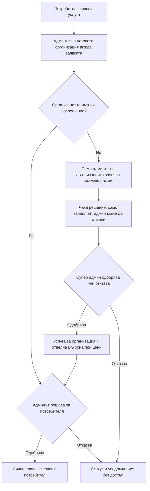

# Чернова за одобрение: услуги, заявки и достъпи / DRAFT: service requests and grants

**Статус към 2026-10-01:** ревизирана чернова за окончателен преглед.
Собственикът уточни, че администраторско разрешаване на услуга действа
**веднага**, без второ приемане; нова покана изисква собствено и фамилно
име плюс имейл; потребителският екран не се променя. Новите административни
списъци, отмяната, уведомленията и полетата **не са внедрени**. Документът е
извън публичното меню на Docusaurus. Преди код собственикът трябва да
потвърди именно тази ревизирана логика и екрани.

## Български

### Източник на самоличност и данни

- OpenRemote/Keycloak удостоверява realm и subject. GrideX API определя
  действителната роля от текущото членство и изрично разрешения platform
  subject; frontend получава резултата чрез `/api/v1/me`. Бутон или скрита
  секция не е защита — API повтаря проверката за всяко действие.
- Вече съществуват PostgreSQL таблици `organisation_memberships`,
  `service_catalog`, `organisation_services`, `member_services`,
  `organisation_market_zones`, `service_requests` и
  `service_request_events`. TimescaleDB пази пазарни и телеметрични данни,
  не роли и одобрения. Наличните таблици за заявки не съдържат пълна логика
  за „предложение/покана“ или „отменена заявка“.
- Предложение: всяка нова покана, заявка, промяна на статус, решение,
  получател, актьор и час да има траен запис и одит в backend PostgreSQL.
  Списъците се четат със server-side странициране и филтриране, без лимит
  на общия брой и без изтегляне на всички организации към клиентски браузър.
- Идентификацията във всеки администраторски ред е **собствено име + фамилия
  + имейл** на съответния администратор или потребител; имейлът остава видим
  дори при съвпадащи имена. За нови покани и двете имена и имейлът са
  задължителни. Имената са атрибути на удостоверената OpenRemote/Keycloak
  идентичност, а backend пази необходимия запис за поканата и одита.
  За стари акаунти с празни имена показвай точния имейл и ясно „Допълнете
  имената в Профил“, без измислени имена и без да скриваш поканата. След
  запазване в профила списъците се опресняват от потвърдената идентичност.
- Read-only проверката на тестовия обект установи приета покана за първия
  администратор на организацията и приета покана за един наблюдател; и
  трите разгледани identity профила имат празни `first_name`/`last_name`.
  Това е причина за fallback към имейл, а не доказателство за липсваща
  покана. Не записвай личните адреси или реални имена в публични примери.

### Предложен поток



Супер администраторът може и сам да разреши услуга на активна организация.
Администраторът на организацията може сам да разреши вече организационно
достъпна услуга на свой одобрен потребител. Това е **незабавно администраторско
разрешение**, не чака второ „Приеми“ от получателя; изпраща се уведомителен
имейл и действието се одитира. Бутоните трябва да казват „Разреши и уведоми“,
а не „Покани“, за да не внушават чакащо приемане. Заявка сама по себе си
не дава достъп. Отнемането на организационно право каскадно спира личните
права; повторното разрешаване не ги възстановява автоматично.

### Три екрана — предложена редакция за одобрение

Няма избор на роля в работещия сайт. Трите екрана се показват един до друг
само в прегледа; реалният потребител вижда единствено екрана, позволен от
backend правата му.

1. **Супер администратор** — съществуващият
   „Клиенти и договори → Потребители и покани → Услуги“:
   избор на активна организация; ред за всяка услуга и BG зона; отделни
   списъци „Поканени организации и чакащи решения“ и „Одобрени организации
   и услуги“. Ред: организация, **две имена + имейл на администратора**,
   услуга/зона, статус, изпратена/решена на, допустимо действие. Търсене,
   статус филтър и странициране. Спряната организация е само за преглед.
2. **Администратор на организация** — същият съществуващ раздел, само за
   собствената организация. В „Услуги за организацията“ всяка неразрешена
   заявяема услуга има **„Заяви“**; при чакаща заявка бутонът става
   **„Отмени заявката“**, достъпен само за администратора. Отделни списъци
   „Поканени потребители и техните заявки“ и „Одобрени потребители и
   услуги“, с **две имена + имейл на всеки потребител**, търсене, статус и
   странициране. Одобрение за организация не включва автоматично никой
   потребител. Действието „Разреши и уведоми“ дава лично право веднага.
3. **Потребител** — съществуващият предложен „Профил → Услуги“ остава
   **без промяна**: личен каталог, бутон „Заяви“ за заявяемите услуги и
   личен статус. Няма административни списъци, избор на организация или
   администраторски действия.

```text
СУПЕР АДМИН  Клиенти и договори / Потребители и покани / Услуги
  [Избери одобрена организация]   [Услуги и BG зона: разреши/откажи/отнеми]
  Поканени организации и чакащи решения   [Търси] [Статус]
  Организация | Админ: две имена + имейл | Услуга | Статус | Дата
                                                      [Назад] 1/N [Напред]
  Одобрени организации и услуги           [Търси]
  Организация | Админ: две имена + имейл | Услуга | Решена на
                                                      [Назад] 1/N [Напред]

АДМИН НА ОРГАНИЗАЦИЯ  Клиенти и договори / Потребители и покани / Услуги
  Услуги за организацията: [Заяви] → [Чака решение] [Отмени заявката]
  Поканени потребители и техните заявки   [Търси] [Статус]
  Две имена + имейл | Услуга | Статус | Дата | Действие
                                                      [Назад] 1/N [Напред]
  Одобрени потребители и услуги           [Търси]
  Две имена + имейл | Услуга | Решена на           [Назад] 1/N [Напред]

ПОТРЕБИТЕЛ  Профил / Услуги — без промяна
  Личен каталог: [Заяви] / [Чака решение] / [Предстои]
```

Всички списъци са за произволен брой записи. Desktop показва редове; mobile
ги подрежда вертикално без хоризонтално скролиране. При празен резултат се
показва „Няма записи“, а при грешка — съобщение с безопасен повторен опит.
След запис екранът показва потвърден от API резултат; не приема непотвърдено
изпращане за успех.

### Задължителни проверки преди внедряване

- Изрично одобрение от собственика на този поток и на ревизираните три
  екрана, включително на поведението на предложенията.
- Backend миграция само за липсващите състояния/събития, имена в поканите
  и pagination,
  без изтриване или пренаписване на съществуващи заявки и разрешения.
- Тестове за роли, cross-realm отказ, много записи, филтри, отмяна,
  двойно натискане, имейл без дублиране, отнемане и безопасно възстановяване.
- След реално внедряване: BG/EN публична помощ в Docusaurus и връзка
  „Помощ“ от всеки засегнат екран. Преди това тази чернова не влиза в
  публичната навигация.

## English

**Status:** proposal only. The member screen stays unchanged. The revised
admin lists, request cancellation, offers and email behavior are not yet
approved as one workflow or claimed live.

OpenRemote/Keycloak authenticates the realm and subject; the GrideX API derives
the actual role from current membership and the explicitly allowed platform
subject. The API, not a hidden frontend control, authorizes every action.
Organisation roles, grants, requests and events live in GrideX PostgreSQL;
TimescaleDB stores market and telemetry series, not these rights. Offers and
cancellation need new backend states/events after approval. All invitations,
requests, decisions, actors and timestamps must persist and remain auditable.
Lists use server-side pagination and filtering for any number of records.

The member requests a service from their organisation administrator. If the
organisation lacks it, only that administrator may request it from the
platform administrator and cancel their pending request. The platform
administrator approves or rejects the organisation grant and separately the
BG market zone where applicable. The organisation administrator then decides
the member grant. No request grants access. Revoking an organisation grant
stops member grants; re-granting does not silently restore them. Platform-
initiated organisation offers and organisation-admin-initiated member offers
are immediate, audited administrator grants with notification email and no
second recipient acceptance. Use “Grant and notify,” not “Invite,” for these
actions. New invitation forms require first name, last name and email.
Administrator rows show all three fields. Older identity profiles with
missing names show the email and a prompt to complete the profile; never
invent names. The first organisation admin invitation and one viewer
invitation in the pilot are accepted, but the three inspected identity
profiles have empty name fields. No customer addresses belong in public
examples.

**Screens:** platform admin sees one selected active organisation, its
service/zone controls, a paginated searchable list of invitations/pending
decisions and a separate list of approved organisation grants. Organisation
admin sees only their organisation, Request/Cancel on unapproved requestable
service rows, a list of invited/pending members and a separate list of
approved member grants. Both admin lists show first name, last name and email
for every person. Member sees the existing personal service catalog
unchanged, with no administration lists. The real site never exposes a
role-switching control; it renders the one verified role. Mobile stacks rows
without horizontal overflow. Empty, error, retry and confirmed-success states
must be documented. After owner approval, implement and test; only then
publish BG/EN live Docusaurus help and link it from affected screens.
